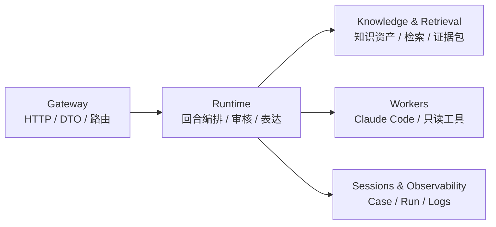

# super helper 系统总览

`super helper` 是一个 chat-first 的企业技术支持首诊助手。它把用户问题转成可审核的诊断契约，优先复用历史经验和知识库，必要时升级只读 Worker，最后只把通过 Evidence Review 的结论展示给用户。

本页只讲系统边界。用户输入后的详细流程见 [Runtime 总览](runtime/README.md)。

## 一张图看边界



## 五个功能块

| 功能块 | 负责什么 | 不负责什么 | 主要代码 |
| --- | --- | --- | --- |
| Gateway | HTTP 入口、请求解析、状态码、DTO 序列化 | Preflight、Worker 调度、证据审核、最终回复选择 | `src/gateway/` |
| Runtime | 用户回合编排、AnswerGoal、Preflight、答案来源选择、Review、Presentation、事件记录 | HTTP DTO、原始文件持久化、Claude CLI 协议、provider 协议 | `src/runtime/` |
| Knowledge & Retrieval | 知识库文件、pipeline artifact、BM25/Embedding recall、fusion、rerank、evidence pack | 用户最终回复、Evidence Review 决策、Worker 执行 | `src/knowledge/`, `src/retrieval/` |
| Workers | `DiagnosticWorker` port、Claude Code adapter、只读工具策略、输出解析 | Case 编排、用户回复、证据裁决 | `src/workers/` |
| Sessions & Observability | Case repository、上下文构建、日志事件展示、WorkerTrace 脱敏 | 模型调用、诊断决策、工具执行 | `src/sessions/`, `src/observability/` |

## 当前实现的核心原则

- Gateway 只做 transport；业务决策进入 Runtime。
- Runtime 是唯一用户回合编排者；同步和异步聊天共用同一条 pipeline。
- Product Agents 的配置在 `src/agents/`；它们不是散落在 docs 或 worker 中的 prompt。
- Claude Code 和 MCP 是工具，不是产品 Agent；它们返回 evidence，不直接回复用户。
- Knowledge 只在 evidence 足够、质量合格且覆盖 `AnswerGoal` 时支持直答。
- Presentation 只表达 Review 冻结后的 accepted claim/evidence，不能新增事实或提升 outcome。
- Case、Run、Evidence、WorkerTrace 和 DiagnosticLogEvent 是审计链路的基础。

## 用户问题如何被回答

用功能块表示是：

```text
输入与会话 -> 问题契约 -> 答案来源 -> 审核表达 -> 日志沉淀
```

对应文档：

- [输入与会话](runtime/entry-session.md)
- [问题契约](runtime/question-contract.md)
- [答案来源选择](runtime/answer-sources.md)
- [审核与表达](runtime/review-presentation.md)
- [可观测性与沉淀](runtime/observability-curation.md)

## 关键配置与扩展点

| 能力 | 当前边界 |
| --- | --- |
| Workspace | 当前项目/服务目录，是代码和 MCP 检查边界 |
| MCP | 每个 workspace allowlist；默认只读 |
| Claude Code Worker | 每次 run 接收结构化 `DiagnosticRequest`，返回 `DiagnosticResult + WorkerTrace` |
| Knowledge Root | 默认在配置的 knowledge root 下按 workspace 隔离，不写入项目源码目录 |
| Provider | Embedding 与 rerank 在 `src/providers/` 下是同级能力 |
| Retrieval | 新召回策略进入 `src/retrieval/recall/<strategy>/`，通过 registry 接入 |
| Deep Query Planner | 代码升级线索由 `src/runtime/deep-query-planner.ts` 按知识 module 候选、projectType 和过滤后的 anchor terms 生成；路径提示不得硬编码为单一 `src/**` 假设 |
| Observability | Runtime 记录事件，`src/observability/` 只做展示转换 |

## 继续阅读

- 产品目标和验收标准：[PRD](../prd/README.md)
- Product Agent 分工：[产品 Agent 设计](agents.md)
- Runtime 拆分说明：[Runtime 总览](runtime/README.md)
- 开发硬规范：[开发标准](../standards/development.md) 与 [模块边界规范](../standards/module-boundaries.md)
