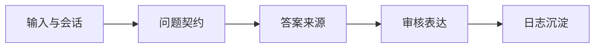

# Runtime 总览

本文档组说明：用户输入一个问题之后，`super helper` 如何通过问题契约、答案来源、证据审核和表达层把问题回答出来。

如果你只想知道代码边界，先读 [系统总览](../overview.md)。如果你想看某个阶段的输入输出，按下表进入对应功能文档。

## 一句话模型

`super helper` 不把用户原话直接丢给 Claude Code。它先形成 `AnswerGoal`，再按成本和可信度选择答案来源，最后只允许通过 Review 的 accepted `primary_answer` claim 进入用户可见回复。

## 简化功能图



## 功能文档

| 功能 | 文档 | 读完能回答 |
| --- | --- | --- |
| 输入与会话 | [entry-session.md](entry-session.md) | `/api/chat` 如何进入 case，sync/async 有什么区别 |
| 问题契约 | [question-contract.md](question-contract.md) | `ResolvedTurnContext`、`AnswerGoal`、Preflight 怎么分工 |
| 答案来源 | [answer-sources.md](answer-sources.md) | Experience、Knowledge、Worker 谁先谁后 |
| 知识库回答 | [knowledge-answering.md](knowledge-answering.md) | 知识证据什么时候能直答，什么时候必须升级 |
| Worker 升级 | [worker-escalation.md](worker-escalation.md) | `DiagnosticRequest`、Claude Code Worker、Deep Query Retry 怎么协作 |
| 审核与表达 | [review-presentation.md](review-presentation.md) | claim/evidence 如何被冻结，Presentation 能做什么 |
| 日志与沉淀 | [observability-curation.md](observability-curation.md) | 用户看不到的过程如何进入日志和 solved case 草稿 |
| 核心契约 | [contracts.md](contracts.md) | 每个阶段传递哪些对象 |

## 主流程压缩版

```text
1. 输入进入 Case，Runtime 接管回合。
2. Runtime 构建 ResolvedTurnContext 和 AnswerGoal，并用 Preflight Gate 判断是否追问。
3. 可诊断时，Runtime 依次尝试 Experience Agent、Knowledge 和 Evidence Judge，必要时升级 Worker。
4. 所有来源的结果统一进入 Result Validator 和 Review Gate。
5. Presentation 只表达 accepted claim/evidence，日志记录完整审计链路。
```

## 关键原则

- Gateway 不做 Preflight、Worker dispatch、证据审核或最终回复格式化。
- Runtime 拥有一个用户回合的业务编排。
- Knowledge、Worker、Experience 都只是 evidence/claim 来源，不直接面向用户。
- 最终回答必须经过 Evidence Review。
- Presentation 不能修改 outcome、accepted IDs 或 case status。
- 诊断日志是审计层，不是主回答来源。
