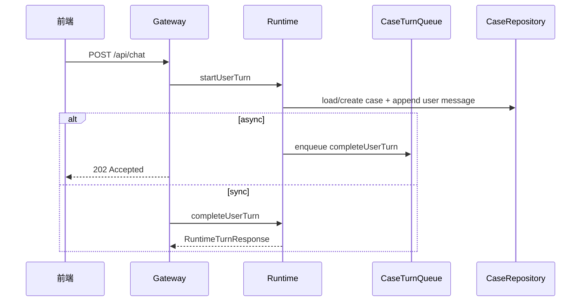

# 输入与会话

## 读者先看

本功能负责把用户输入接入当前 case，并确保同一个 case 的回合顺序可控。它不判断问题能不能回答，也不做证据审核。

## 功能边界

| 负责 | 不负责 |
| --- | --- |
| `/api/chat` 请求进入 Runtime | 判断是否追问 |
| 创建或加载 case | 构造 Worker prompt |
| 写入用户消息和初始日志 | 检索知识库 |
| 同步/异步回合入口 | 审核 claim/evidence |
| 同 case 串行队列 | 生成最终结论 |

## 输入与输出

| 输入 | 输出 |
| --- | --- |
| HTTP chat payload、caseId、persona、workspaceId | `RuntimeTurnResponse` 或 `202 Accepted` |
| 当前 case/session 状态 | 已保存的 user message |
| config 与 repository | 后续阶段可读取的 case context |

## 正常流程

## 失败/降级

| 场景 | 行为 |
| --- | --- |
| case 已归档 | Gateway 或 `SessionLifecycle` 阻止新增回合 |
| async 后台失败 | `recordTurnFailure` 写 helper failure 和日志 |
| 同 case 连续消息 | `CaseTurnQueue` 串行，保证每条 accepted 用户消息都有 helper 回复 |
| Worker CLI 失败 | 不在本层处理；Worker adapter 转成结构化结果后进入 Review |

## 代码入口

- `src/gateway/routes/chat-routes.ts`
- `src/runtime/diagnostic-runtime.ts`
- `src/runtime/turn-queue.ts`
- `src/runtime/session-lifecycle.ts`
- `src/sessions/case-repository.ts`
- `src/sessions/file-memory-store.ts`

## 不负责什么

- 不决定 Preflight 追问或派发。
- 不读取知识库。
- 不调用 Claude Code。
- 不格式化最终用户回复。
- 不把 route DTO 逻辑放进 Runtime。
