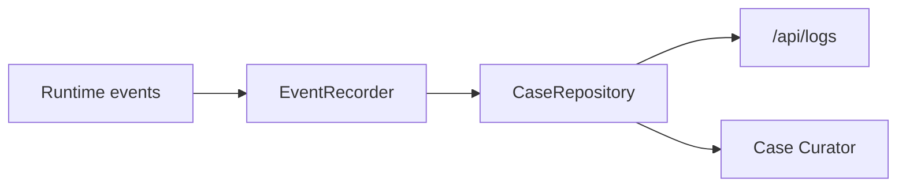

# 可观测性与沉淀

## 读者先看

主聊天只展示 helper reply；诊断过程进入日志、run trace 和 solved case 草稿。这个边界保证过程可追溯，但不能绕过 Review 变成用户最终回答。

Solved Case 只在用户确认解决后生成 `review_required` 草稿，仍需人工审核才能成为 active knowledge。

## 功能边界

| 负责 | 不负责 |
| --- | --- |
| 记录 `DiagnosticLogEvent` | 决定诊断流程 |
| 展示 Agent Activity | 审核 evidence 是否足够 |
| 脱敏 `WorkerTrace` | 生成用户结论 |
| `/api/logs` 读取和转换日志块 | 调用 Worker |
| 用户确认解决后生成 solved case 草稿 | 自动发布 active knowledge |

## 输入与输出

| 输入 | 输出 |
| --- | --- |
| Runtime lifecycle events | `DiagnosticLogEvent[]` |
| Worker command/stdout/stderr/error | bounded `WorkerTrace` |
| case messages/runs/logs | `/api/logs` blocks |
| resolution confirmation | `review_required` solved case draft |

## 正常流程

## 失败/降级

| 场景 | 行为 |
| --- | --- |
| Worker 输出很长 | bounded 截断 |
| provider/secret 出现在错误里 | redaction 后写日志 |
| Presentation 模型回复未通过校验 | 只记录安全结构化结果，不把 raw reply 当可信答复 |
| 用户确认解决但证据不足 | Case Curator 不发布 active knowledge |
| case archived | 可读日志，不允许新增聊天回合 |

## 代码入口

- `src/runtime/event-recorder.ts`
- `src/observability/log-blocks.ts`
- `src/observability/worker-trace.ts`
- `src/gateway/routes/log-routes.ts`
- `src/gateway/routes/session-routes.ts`
- `src/runtime/case-curation-service.ts`
- `src/runtime/case-curator.ts`

## 不负责什么

- 不从日志中选择最终结论。
- 不让诊断日志替代主回复。
- 不把 rejected claims 或 provider payload 暴露给普通用户。
- 不把 `review_required` 草稿自动变成 active knowledge。
